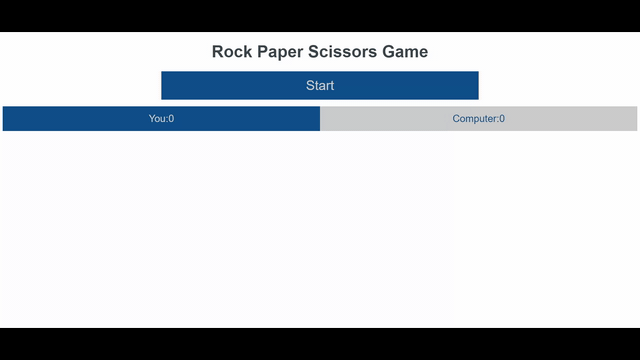

# Project Name

Rock Paper Scissors, play by using your mouse.

## Built With

- HTML,
- CSS,
- JS

## Live Demo

[Live Demo Link](https://safaerden.github.io/Rock-Paper-Scissors/)

## Getting Started

To get a local copy up and running follow these simple example steps.

### Pre-Requisites
Localhost or a web hosting

### Setup
Just download or clone the files

### Usage
Change source code

## Author

👤 **Safa Erden**

- Github: [@safaerden](https://github.com/SafaErden)
- Twitter: [@safaerden](https://twitter.com/safaerden)
- Linkedin: [linkedin](https://www.linkedin.com/in/SafaErden/)
- MQL5: [safaerden](https://www.mql5.com/en/users/safaerden)

## 🤝 Contributing

Contributions, issues and feature requests are welcome!

Feel free to check the [issues page](https://github.com/SafaErden/Rock-Paper-Scissors/issues).

## Show your support

Give a ⭐️ if you like this project!

## 📝 Acknowledgments

- If you are applying issues please just use HTML & CSS & JS
